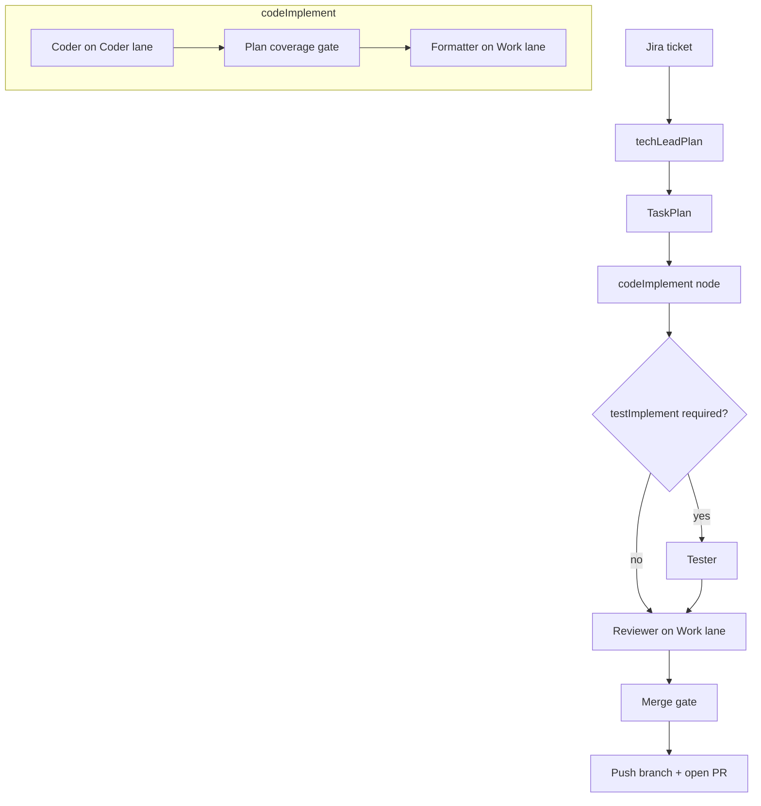

# Sprint Crew v2

> Autonomous sprint agents: Jira ticket → plan → code → test → review → PR

LangGraph-orchestrated multi-agent pipeline that turns Jira tickets (or natural-language prompts) into reviewed pull requests. Built with **Pydantic AI**, **LangGraph**, and **vLLM** on a dual-lane GPU setup with on-demand model loading.

## Highlights

- **LangGraph state machine** — TechLead → Coder+Formatter (inside `codeImplement`) → Tester (conditional) → Reviewer → merge gate → ship
- **Strict Pydantic v2 schemas** — all agent contracts use `extra="forbid"`
- **Dual vLLM lanes** — Coder (:8001) and Work (:8002); only one loaded at a time on 128 GB unified memory
- **Lean test suite** — mock-only unit suite (CI) plus one opt-in end-to-end trap gate
- **Safety by design** — path sandboxing (`resolve_safe_path`), allowlisted shell commands, side effects in orchestrator only

## Architecture



From-prompt flow: user prompt → ScrumMaster (Work lane) → Jira backlog → sequential per-ticket cycles.

See [docs/agent-orchestration.md](docs/agent-orchestration.md) for planning modes, coverage gates, and vector retrieval.

## Quick start (CPU only, no GPU)

```bash
python3.12 -m venv .venv
source .venv/bin/activate
pip install -e ".[dev]"
cp .env.example .env
pytest tests/unit -q
```

Unit tests run on any machine — no vLLM, Jira, or GitHub credentials required.

## Full stack (local GPU + Docker)

```bash
cp .env.example .env          # set HF_TOKEN for model download
./scripts/lane-ctl.sh start work
./scripts/smoke_cycle.py      # full LangGraph cycle on fixtures/repo
./scripts/smoke_cycle.py --coder-only   # Coder + Formatter only
```

## API

| Endpoint | Description |
|----------|-------------|
| `POST /sprint/from-prompt` | Natural language → backlog → sequential sprint cycles |
| `POST /sprint/from-ticket` | Existing Jira ticket → single sprint cycle |
| `GET /sprint/session/{id}` | Session status and event timeline |
| `GET /sprint/backlog/{run_id}` | Backlog orchestration status |
| `POST /sprint/session/{id}/approve` | Record human approval (no auto-merge) |
| `POST /v1/console/sessions` (+ `messages`/`clarify`/`confirm`/`start`/`cancel`) | Interactive console — see [contract](docs/contracts/chat-console-api.md) |
| `GET /v1/console/sessions/{id}/events` | Durable, monotonically sequenced run timeline (polling) |
| `GET /v1/console/sessions/{id}/stream` | Same timeline over SSE, resumable via `Last-Event-ID` |
| `GET /v1/console/sessions/{id}/diff` (+ `/{path}`) | Structured per-file, per-hunk diff of what the agent changed |
| `POST /v1/console/sessions/{id}/diff/decisions` | Accept/reject files and release the parked run ([ADR 0015](docs/adr/0015-human-review-gate.md)) |
| `GET /health` | API health + vLLM lane status |

Start the API:

```bash
uvicorn sprint_crew.api.app:app --host 0.0.0.0 --port 8080
```

## Testing

| Suite | Command | Requires |
|-------|---------|----------|
| Unit / CI | `pytest tests/unit -q` | venv only |
| E2E trap (opt-in) | `VECTOR_AGENT_LIVE=1 VLLM_LIVE=1 pytest tests/agent_live/trap/test_from_prompt_3story_trap.py -v` | GX10 GPU lanes + vector stack |

The single retained live gate is a 3-story from-prompt run against an adversarial
(stdlib-shadow) fixture — the full pipeline end to end. Manual scripts and vLLM probes
are listed in [AGENTS.md §7](AGENTS.md).

## Project layout

```
src/sprint_crew/     Agents, LangGraph pipeline, orchestrator, API, vector index
tests/               unit tests, one e2e trap gate, shared helpers
scripts/             lane-ctl, probes, smoke, benchmarks
infra/               docker-compose, models.yaml, embed-sidecar
fixtures/            greeter smoke repo, vector e2e repos, trap fixtures
docs/                orchestration, evaluation runbooks
benchmarks/          scenario matrix + scorecard tooling
```

## Documentation

- [Docs index](docs/README.md)
- [Agent orchestration](docs/agent-orchestration.md)
- [Model evaluation](docs/model-evaluation.md)
- [Console API contract](docs/contracts/chat-console-api.md)
- [Agent policies (AGENTS.md)](AGENTS.md)
- [Portfolio blurb for CV/LinkedIn](docs/portfolio-blurb.md)
- [Archived history (bullets)](docs/archive/HISTORY.md)

## Note on hardware

The opt-in e2e trap gate requires Docker, NVIDIA runtime, and NVFP4 model weights. The orchestrator loads **one lane at a time** to fit 128 GB unified memory — per-lane weights and `gpu_memory_utilization` targets are in [AGENTS.md §4.1](AGENTS.md). The unit suite needs none of this.

## For recruiters

Sprint Crew v2 is a production-shaped autonomous coding agent system: it plans multi-file changes, implements them with tool-using LLMs, validates with pytest, reviews for scope and correctness, and opens a GitHub PR — with human merge approval as the final gate. The codebase demonstrates LangGraph orchestration, strict schema contracts, a lean mock-based test suite with one opt-in end-to-end trap gate, and operational concerns (lane lifecycle, retries, plan coverage gates).

Copy the full blurb from [docs/portfolio-blurb.md](docs/portfolio-blurb.md).
