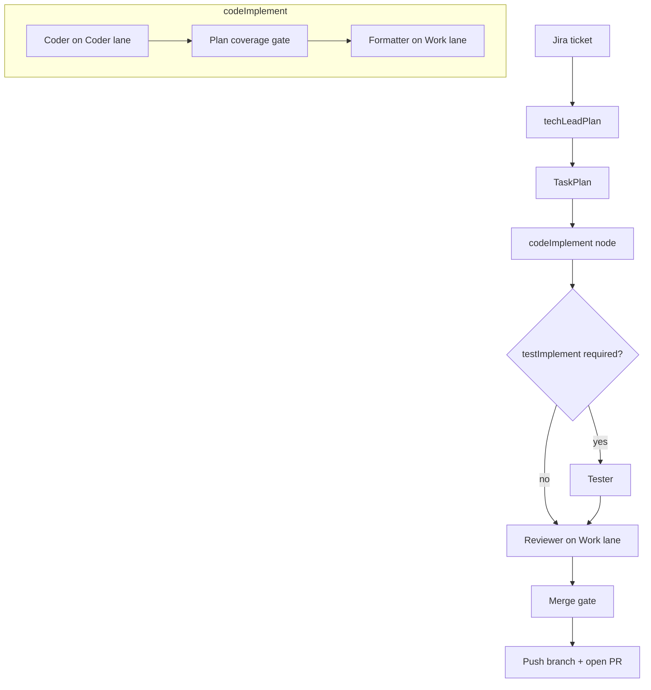

# Sprint Crew v2

> Autonomous sprint agents: Jira ticket → plan → code → test → review → PR

LangGraph-orchestrated multi-agent pipeline that turns Jira tickets (or natural-language prompts) into reviewed pull requests. Built with **Pydantic AI**, **LangGraph**, and **vLLM** on a dual-lane GPU setup with on-demand model loading.

## Highlights

- **LangGraph state machine** — TechLead → Coder+Formatter (inside `codeImplement`) → Tester (conditional) → Reviewer → merge gate → ship
- **Strict Pydantic v2 schemas** — all agent contracts use `extra="forbid"`
- **Dual vLLM lanes** — Coder (:8001) and Work (:8002); only one loaded at a time on 128 GB unified memory
- **Tiered test pyramid** — unit → sandbox integration → GPU agent_live → vector tiers
- **Safety by design** — path sandboxing (`resolve_safe_path`), allowlisted shell commands, side effects in orchestrator only

## Architecture



From-prompt flow: user prompt → ScrumMaster (Work lane) → Jira backlog → sequential per-ticket cycles.

See [docs/agent-orchestration.md](docs/agent-orchestration.md) for planning modes, coverage gates, and vector retrieval tiers.

## Quick start (CPU only, no GPU)

```bash
python3.12 -m venv .venv
source .venv/bin/activate
pip install -e ".[dev]"
cp .env.example .env
pytest tests/unit -q
```

Unit tests run on any machine — no vLLM, Jira, or GitHub credentials required.

## Full stack (local GPU + Docker)

```bash
cp .env.example .env          # set HF_TOKEN for model download
./scripts/lane-ctl.sh start work
./scripts/smoke_cycle.py      # full LangGraph cycle on fixtures/repo
./scripts/smoke_cycle.py --coder-only   # Coder + Formatter only
```

GX10 test suite (preflight + real ship cycle):

```bash
./scripts/run_gx10_test_suite.sh
```

## API

| Endpoint | Description |
|----------|-------------|
| `POST /sprint/from-prompt` | Natural language → backlog → sequential sprint cycles |
| `POST /sprint/from-ticket` | Existing Jira ticket → single sprint cycle |
| `GET /sprint/session/{id}` | Session status and event timeline |
| `GET /sprint/backlog/{run_id}` | Backlog orchestration status |
| `POST /sprint/session/{id}/approve` | Record human approval (no auto-merge) |
| `POST /v1/console/sessions` (+ `messages`/`clarify`/`confirm`/`start`/`cancel`) | Interactive console MVP — see [contract](docs/contracts/chat-console-api.md) |
| `GET /health` | API health + vLLM lane status |

Start the API:

```bash
uvicorn sprint_crew.api.app:app --host 0.0.0.0 --port 8080
```

## Testing tiers

| Tier | Command | Requires |
|------|---------|----------|
| 1 — Unit / CI | `pytest tests/unit -q` | venv only |
| 2 — Sandbox | `INTEGRATION_LIVE=1 pytest tests/integration_live -m "integration_live and not vllm_live" -q` | Jira + GitHub tokens |
| 3 — GPU | `./scripts/run_gx10_test_suite.sh` | Docker + vLLM lanes |
| Preflight | `PREFLIGHT_LIVE=1 pytest -m preflight` | Work + Coder lanes |
| Vector | `VECTOR_LIVE=1 pytest -m vector_live -q` | Qdrant + embed sidecar |

See [docs/integration-testing.md](docs/integration-testing.md) for sandbox setup and cleanup.

## Project layout

```
src/sprint_crew/     Agents, LangGraph pipeline, orchestrator, API, vector index
tests/               unit, integration_live, agent_live, vector_live, preflight
scripts/             lane-ctl, probes, smoke, GX10 suite, benchmarks
infra/               docker-compose, models.yaml, embed-sidecar
fixtures/            greeter smoke repo, vector e2e repos, trap fixtures
docs/                orchestration, testing, evaluation runbooks
benchmarks/          scenario matrix + scorecard tooling
```

## Documentation

- [Docs index](docs/README.md)
- [Product vision (Target) and roadmap](docs/vision/product-vision.md) — future interactive console; see [docs/roadmap.md](docs/roadmap.md)
- [Agent orchestration](docs/agent-orchestration.md)
- [Integration testing](docs/integration-testing.md)
- [Model evaluation](docs/model-evaluation.md)
- [Agent policies (AGENTS.md)](AGENTS.md)
- [Portfolio blurb for CV/LinkedIn](docs/portfolio-blurb.md)

## Note on hardware

GPU tiers require Docker, NVIDIA runtime, and NVFP4 model weights (~46 GB Coder, ~20 GB Work). The orchestrator loads **one lane at a time** to fit 128 GB unified memory. Unit tests and sandbox integration tests do not need a GPU.

## For recruiters

Sprint Crew v2 is a production-shaped autonomous coding agent system: it plans multi-file changes, implements them with tool-using LLMs, validates with pytest, reviews for scope and correctness, and opens a GitHub PR — with human merge approval as the final gate. The codebase demonstrates LangGraph orchestration, strict schema contracts, tiered live testing, and operational concerns (lane lifecycle, retries, plan coverage gates).

Copy the full blurb from [docs/portfolio-blurb.md](docs/portfolio-blurb.md).
