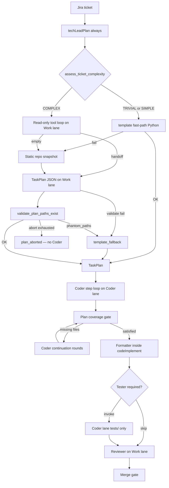

# Agent orchestration — multi-file sprint cycles

How sprint-crew-v2 plans, implements, and validates multi-file changes.

## Pipeline flow



## Deterministic vs LLM enforcement

| Check | Enforced by | When |
|-------|-------------|------|
| Allowlisted acceptance test commands | Python `validate_acceptance_tests` | After TechLead |
| `files_to_touch` vs step files | Python `validate_plan_structure` | After TechLead |
| Planned paths exist in repo (phantom rejection) | Python `validate_plan_paths_exist` | After TechLead, before Coder |
| All planned files changed | Python `validate_plan_coverage` | Early exit + before Formatter |
| Phantom paths in plan (not in baseline) | Python `validate_plan_coverage.phantom_paths` | After Coder; triggers `retry_scope=plan` |
| Out-of-scope file touches | Python `validate_plan_coverage` | Early exit + before Formatter |
| Step-by-step implementation | Orchestrator `run_coder_plan` | During Coder |
| Test honesty / scope / blockers | Reviewer LLM + re-run tests | Review node |
| `write_file` size cap | Python `WriteFileTool` | Each tool call |

## TechLead planning modes

All tickets enter **`techLeadPlan`** (no separate graph branch). Mode selection is internal:

- **`template`** — TRIVIAL/SIMPLE tickets: deterministic TaskPlan in Python first (no Work lane). Fast path for stub/greeter/email-style work.
- **`static`** — when template validation fails or SIMPLE needs LLM: Python repo snapshot → TaskPlan JSON on Work lane (:8002).
- **`tool_loop`** — COMPLEX tickets only: seeded `enrich_repo_context` (manifest + pre_search + grep) → read-only tools on Work lane → handoff → TaskPlan JSON with separate ground-truth `repo_context`. Requires vLLM `--tool-call-parser hermes` on :8002.
- **`template_fallback`** — after two failed LLM plan validations, fall back to deterministic template.

Fallback chain: template fast-path → static LLM → (COMPLEX) tool_loop with empty-handoff → static → template_fallback after validation retries.

Event `tech_lead.plan_created` includes `detail.mode` for benchmarking.

## Coder step orchestration

When `CODER_STEP_MODE=true` (default) and the TaskPlan has **more than one step**:

1. Each step runs a **fresh** Coder session with a step-specific prompt.
2. Context between steps: full TaskPlan JSON + truncated workspace diff.
3. Turn budget per step: `max(4, MAX_CODER_TURNS // step_count)`.

Single-step plans use one Coder session (fast path).

## Plan coverage gate

`validate_plan_coverage` compares `files_to_touch` + all `step.files` against changed paths from:

- `git diff --name-only`
- `git diff --cached --name-only`
- `git status --porcelain` (includes untracked files from `write_file`)

**Early exit** (Coder stops tool loop when acceptance tests pass) only fires when:

- diff is non-empty, and
- `CODER_EARLY_EXIT_REQUIRES_COVERAGE=true` (default) → coverage is satisfied.

After the main Coder run, up to `MAX_COVERAGE_ROUNDS` continuation rounds prompt the Coder to finish missing files. If still incomplete, Formatter runs anyway; event `plan_coverage_incomplete` is logged and **merge gate rejects** when `plan_coverage.satisfied` is false.

## Tester skip rules

Tester is **skipped** when:

1. Orchestrator-verified `acceptance_tests` are green (Reviewer audits AC either way).
2. The TaskPlan already lists files under `tests/` in `steps[].files` or `files_to_touch` (Coder owns those tests).

Tester is **invoked** when:

- `acceptance_tests` fail after Coder, and
- source files changed but nothing under `tests/` changed, and
- the TaskPlan did not assign test files to Coder.

Tester tool calls that target paths outside `tests/` return an error message to the model (soft-fail) instead of crashing the graph.

## Ticket authoring guidelines

- Keep tickets small enough for one PR (ScrumMaster enforces this in BacklogPlan).
- Name expected files in the ticket description when possible — TechLead static mode reads up to 8 path-like strings from the ticket.
- Write human acceptance criteria; TechLead maps them to shell commands in `acceptance_tests`.
- For multi-file work, expect multiple `PlanStep` entries with explicit `files` lists.

## Troubleshooting

### Coder finished too early

- Check session events for `plan_coverage_incomplete` and the `missing` file list.
- Verify `files_to_touch` in TaskPlan matches what the ticket requires.
- Increase `MAX_COVERAGE_ROUNDS` or `MAX_CODER_TURNS` if continuation rounds exhaust the budget.

### Missing files in plan coverage

- Untracked files count — if a file was written but not detected, check git status in the workspace.
- Ensure TechLead listed every file in both `steps[].files` and `files_to_touch`.

### Phantom paths in plan

- Symptom: tests green but merge gate red; `plan_coverage_incomplete` lists paths that never existed in the repo (e.g. `src/ferry/layer.py` instead of `src/messaging/ferry.py`).
- TechLead `tool_loop` must use seeded repo manifest + `pre_search` hits; `validate_plan_paths_exist` rejects the plan before Coder runs.
- If phantom paths slip through, `plan_coverage.phantom_paths` forces `retry_scope=plan` instead of Coder continuation.
- Check session events for `plan_aborted` or `plan_validation_failed` detail.

### write_file rejected

- Content exceeded `MAX_WRITE_FILE_BYTES` (default 64 KB). Use `apply_patch` for large edits.

## Environment variables

| Variable | Default | Purpose |
|----------|---------|---------|
| `CODER_STEP_MODE` | `true` | Step-by-step Coder sessions |
| `CODER_EARLY_EXIT_REQUIRES_COVERAGE` | `true` | Block early exit until plan files are touched |
| `MAX_COVERAGE_ROUNDS` | `2` | Coder continuation attempts after coverage failure |
| `MAX_TECHLEAD_TURNS` | `12` | Read-only TechLead tool loop limit |
| `MAX_WRITE_FILE_BYTES` | `65536` | `write_file` size cap |
| `MAX_CODER_TURNS` | `32` | Total Coder turn budget (split per step) |
| `VECTOR_INDEX_ENABLED` | `true` | Qdrant semantic index (unit tests autouse `false`) |
| `QDRANT_URL` | `http://127.0.0.1:6333` | Qdrant HTTP API |
| `EMBED_URL` | `http://127.0.0.1:8080/v1` | CPU embedding sidecar (Jina code model) |
| `VECTOR_TOP_K` | `8` | Default semantic_search result count |
| `VECTOR_SCORE_THRESHOLD` | `0.55` | Minimum cosine score for hits |

## Vector index (Qdrant + embeddings)

Semantic retrieval layer. **On by default** (`VECTOR_INDEX_ENABLED=true` on GX10/dev). Unit tests and CI force `VECTOR_INDEX_ENABLED=false` via pytest autouse fixture.

### When indexing runs

Orchestrator calls `maybe_index_workspace` after `prepare_workspace` when:

- `should_use_vector` is true (ticket/prompt complexity is **SIMPLE** or **COMPLEX**), and
- the workspace has at least one indexable file.

**TRIVIAL** tickets (greeter template fast-path) skip indexing and retrieval entirely.

Failures are logged and the sprint continues without semantic search.

### Infrastructure

```bash
./scripts/lane-ctl.sh start vector   # Qdrant :6333 + embed-sidecar :8080
./scripts/lane-ctl.sh health vector
python scripts/probe_vector_index.py
```

Default embedding model: `jinaai/jina-embeddings-v2-base-code` (Apache 2.0, CPU sidecar).

### Agent integration

| Consumer | Behavior |
|----------|----------|
| **ScrumMaster** (`from-prompt`) | `enrich_repo_context` adds repo manifest + pre_search + semantic hits |
| **TechLead static** (SIMPLE) | `enrich_repo_context` pre-fetches manifest + pre_search into Work lane prompt |
| **TechLead tool_loop** (COMPLEX) | Seeded manifest/pre_search in loop prompt; `semantic_search` tool + verify with `grep` / `read_file`; JSON step uses ground-truth `repo_context` + handoff |
| **Template / TRIVIAL** | No index; template plan from Python (path validation skipped) |

Context order in `enrich_repo_context`: `_gather_repo_context` → `repo_manifest` → `keyword_grep` → `pre_search` → `semantic_search`.

Retrieval pattern: **manifest (ground truth) → pre_search / semantic_search → grep → read_file**. Merge gate and plan coverage remain deterministic (git diff + `snapshot_baseline_paths`).

**Multi-story `from-prompt` backlog:** stories run sequentially — each story runs the full LangGraph cycle via `create_and_run_cycle` (plan → code → test → review → ship). Story N+1 uses `prepare_chained_workspace` (copy of story N workspace on a fresh branch). Failed story stops the backlog with `failed_ticket_key` and `completed_session_ids` on `BacklogRun`.

## Ship (orchestrator side effects)

Shipping is **never** done inside LLM tools:

| Module | Role |
|--------|------|
| [`orchestrator/git_commit.py`](../src/sprint_crew/orchestrator/git_commit.py) | Shared local git checkout/add/commit used by stub and real ship |
| [`orchestrator/ship_cycle.py`](../src/sprint_crew/orchestrator/ship_cycle.py) | LangGraph `orchestratorShip` node — local git commit stub or delegates to real ship |
| [`orchestrator/sprint.py`](../src/sprint_crew/orchestrator/sprint.py) | Real push, GitHub PR, Jira transitions when `use_real_ship=true` |

Live tests (vector tiers — see [integration-testing.md](integration-testing.md#vector-test-pyramid)):

| Tier | Marker | Role |
|------|--------|------|
| Stack | `vector_live` | Qdrant + embed only |
| Capability | `agent_capability` | Per-story cycles (SOFT in full suite) |
| Integration | `agent_integration` + `nightly` | 2-story from-prompt (HARD gate) |
| Trap | `agent_trap` | Adversarial / stdlib shadow (SOFT) |
| A/B | `vector_agent_live` | Greeter fixture vector on/off |

```bash
VECTOR_LIVE=1 VECTOR_INDEX_ENABLED=1 pytest -m vector_live -q
./scripts/lane-ctl.sh start vector
VECTOR_AGENT_LIVE=1 VLLM_LIVE=1 pytest tests/agent_live/integration/ \
  -m "vector_agent_live and agent_integration and nightly" -v
VECTOR_AGENT_LIVE=1 VLLM_LIVE=1 pytest tests/agent_live/test_sprint_vector_ab.py -m vector_agent_live -v
python scripts/agent_scorecard.py
```

The A/B test runs two full sprint cycles (vector off vs on) and writes `benchmarks/results/vector_ab_*.json`.

See also [`AGENTS.md`](../AGENTS.md) and [`docs/integration-testing.md`](integration-testing.md).
