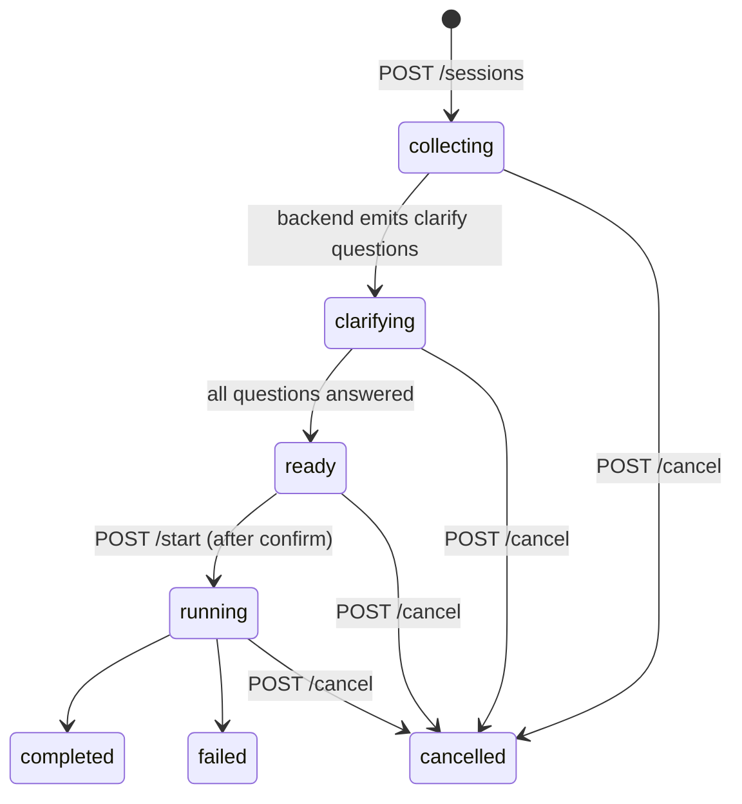

# Chat console API contract

**Status: Implemented (MVP store + stub clarify).** The `/v1/console/*` routes are live in [console.py](../../src/sprint_crew/api/console.py), mounted alongside the existing `/sprint/*` and `/health` API (see [app.py](../../src/sprint_crew/api/app.py)). The separate UI repo ([ADR 0011](../adr/0011-web-console-off-gx.md)) can target these routes directly. Machine-readable spec: [chat-console.openapi.yaml](chat-console.openapi.yaml). Pydantic models: `src/sprint_crew/schemas/console.py`.

Implementation status / MVP limitations:

- Sessions are held in a **process-local in-memory store**: they do not survive an API restart and are not shared across workers (single-worker assumption).
- **Clarify is a deterministic stub** — 2–3 fixed questions (scope, tests, and API compatibility when the prompt mentions an API/endpoint/route), lightly derived from the prompt text, no LLM call. All stub questions set `allow_custom: true`.
- `POST /start` with `mode=code` reuses the same orchestration as `POST /sprint/from-prompt` (which remains unchanged for direct callers); the clarify answers are appended to the prompt.
- `POST /cancel` on a `running` code-mode session marks the console session `cancelled` but does **not** stop the already-dispatched backlog run (no kill support today).
- Progress mirroring: `GET /sessions/{id}` refreshes a running code-mode session from the backlog run (`sprint_ref.sprint_session_ids`, completed/failed status); clients may also poll `GET /sprint/backlog/{run_id}` directly.

Notes:

- **Auth: TBD.** The contract assumes an authenticated caller; the mechanism is decided before Phase 2 ships.
- **Streaming (SSE/WebSocket) is a non-goal** for this contract version; the UI polls.
- `target_language` is a nullable placeholder for Phase 3 language-specialized lanes; senders should pass `null`.

## Session state machine



Statuses: `collecting | clarifying | ready | running | completed | failed | cancelled`. Confirmation is a separate boolean (`confirmed`) set by `POST /confirm` while `ready`; `POST /start` is rejected until `status == "ready"` and `confirmed == true`. Per [ADR 0012](../adr/0012-plan-code-modes-and-clarify.md), no sprint run ever starts from a raw prompt alone.

Modes: `plan` (analysis/backlog preview only — never ships, no branch/PR) and `code` (after start, maps to today's ship-to-PR pipeline ending at `awaiting_human` per ADR 0010).

## Shared shapes

`ClarifyQuestion` — one open point the backend wants settled before a run:

```json
{
  "question_id": "q-scope",
  "text": "Which part of the repo should change?",
  "suggestions": [
    {"suggestion_id": "s-api", "label": "API layer only", "detail": "src/sprint_crew/api"},
    {"suggestion_id": "s-full", "label": "API + orchestrator", "detail": null}
  ],
  "allow_custom": true
}
```

`ClarifyAnswer` — exactly one of `selected_suggestion_id` or `custom_text` (`custom_text` is valid only when the question has `allow_custom: true`):

```json
{"question_id": "q-scope", "selected_suggestion_id": "s-api", "custom_text": null}
```

```json
{"question_id": "q-scope", "selected_suggestion_id": null, "custom_text": "only the CLI entry points"}
```

Errors use FastAPI's envelope: `{"detail": "<message>"}` with 400 (invalid transition/body semantics), 404 (unknown session), 409 (state conflict, e.g. start before confirm), 422 (schema validation).

## Endpoints

### POST /v1/console/sessions

Create a console session. Request:

```json
{
  "mode": "code",
  "initial_prompt": "Add a /metrics endpoint with request counters",
  "repo_url": "https://github.com/example/service",
  "target_language": null
}
```

Response `201` — full session object, `status: "collecting"` (or `"clarifying"` if the backend already produced questions from `initial_prompt`):

```json
{
  "session_id": "cs-7f3a",
  "mode": "code",
  "status": "collecting",
  "confirmed": false,
  "repo_url": "https://github.com/example/service",
  "target_language": null,
  "messages": [
    {"role": "user", "content": "Add a /metrics endpoint with request counters", "timestamp": "2026-07-16T09:00:00+00:00"}
  ],
  "clarify_questions": [],
  "clarify_answers": [],
  "sprint_ref": null,
  "plan_result": null,
  "error": null,
  "created_at": "2026-07-16T09:00:00+00:00",
  "updated_at": "2026-07-16T09:00:00+00:00"
}
```

Errors: `422` unknown/extra fields (`extra="forbid"`), invalid `mode`.

### GET /v1/console/sessions/{id}

Return the full session object (same shape as above). The UI polls this for state transitions. Errors: `404` unknown session.

### POST /v1/console/sessions/{id}/messages

Append a user chat message; the backend may respond with assistant messages and/or move to `clarifying`.

```json
{"content": "It should also cover the backlog endpoints"}
```

Response `200`: updated session. Errors: `404`; `409` if session is `running` or terminal; `422` empty content.

### POST /v1/console/sessions/{id}/clarify

Submit answers to pending clarify questions.

```json
{
  "answers": [
    {"question_id": "q-scope", "selected_suggestion_id": "s-api", "custom_text": null},
    {"question_id": "q-tests", "selected_suggestion_id": null, "custom_text": "unit tests only, no live tiers"}
  ]
}
```

Response `200`: updated session — `status: "ready"` once every pending question is answered, otherwise still `clarifying`. Errors: `404`; `400` unknown `question_id`, both/neither answer fields set, or `custom_text` for a question with `allow_custom: false`; `409` if not in `clarifying`.

### POST /v1/console/sessions/{id}/confirm

Explicit user confirmation of the clarified request. Empty body. Response `200`: session with `confirmed: true` (status stays `ready`). Errors: `404`; `409` if `status != "ready"`.

### POST /v1/console/sessions/{id}/start

Start the run. Empty body. Allowed only when `status == "ready"` and `confirmed == true`; response `200` with `status: "running"`.

- **mode = code**: the backend drives today's from-prompt pipeline. The session gains a `sprint_ref` for progress polling (see mapping below):

```json
{"sprint_ref": {"backlog_run_id": "run-91c2", "sprint_session_ids": []}}
```

- **mode = plan**: analysis only; on completion `status: "completed"` and `plan_result` is set — nothing is shipped:

```json
{
  "plan_result": {
    "summary": "Two stories: metrics endpoint, backlog counters",
    "stories": [
      {"title": "Expose /metrics with request counters", "rationale": "observability baseline"},
      {"title": "Count backlog endpoint hits", "rationale": null}
    ]
  }
}
```

Errors: `404`; `409` not ready or not confirmed (e.g. `{"detail": "session must be confirmed before start"}`).

### POST /v1/console/sessions/{id}/cancel

Cancel from any non-terminal state. Empty body. Response `200` with `status: "cancelled"`. Errors: `404`; `409` if already `completed`, `failed`, or `cancelled`.

## Mapping to the current /sprint/* API

| Console (Proposed) | Current endpoint (live today) | Notes |
|--------------------|-------------------------------|-------|
| `POST /v1/console/sessions`, `/messages`, `/clarify`, `/confirm` | — | New pre-run steps; no current equivalent |
| `POST /v1/console/sessions/{id}/start` (mode=code) | `POST /sprint/from-prompt` | Runs only after clarify + confirm; existing endpoint unchanged |
| `POST /v1/console/sessions/{id}/start` (mode=plan) | — | Analysis only, never ships |
| Progress after Code start | `GET /sprint/backlog/{run_id}`, `GET /sprint/session/{session_id}` | Via `sprint_ref` id mapping below |
| Human merge approval | `POST /sprint/session/{session_id}/approve` | Unchanged; ADR 0010 gate stays |
| `POST /v1/console/sessions/{id}/cancel` | — | No current equivalent |

**Id mapping for progress polling (Code mode):** after start, `ConsoleSession.sprint_ref.backlog_run_id` is a `run_id` for the existing `GET /sprint/backlog/{run_id}`. That `BacklogRun.session_ids` lists per-ticket sprint session ids, each usable with the existing `GET /sprint/session/{session_id}` (event timeline, PR URL, `awaiting_human`). `sprint_ref.sprint_session_ids` mirrors the backlog run's `session_ids` as they are created. Console session ids (`cs-*` here) and sprint session ids are distinct id spaces.
