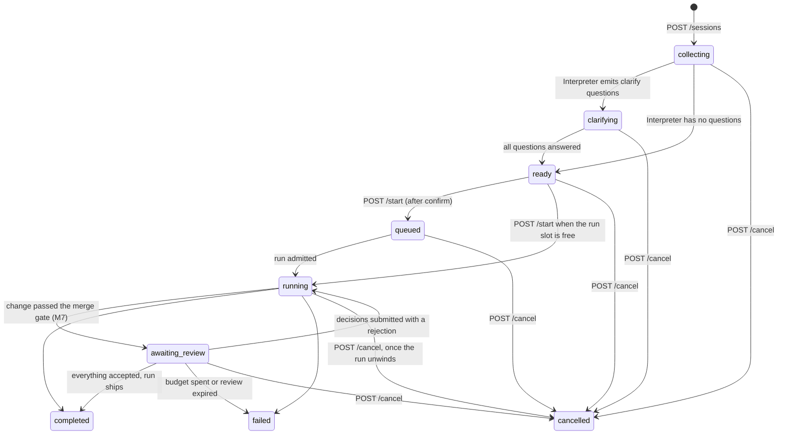

# Chat console API contract

**Status: Implemented (durable sessions, SSE timeline, queued + cancellable runs, structured diffs, per-file review).** The `/v1/console/*` routes are live in [api/console/](../../src/sprint_crew/api/console/), mounted alongside the existing `/sprint/*` and `/health` API (see [app.py](../../src/sprint_crew/api/app.py)). A separate off-GX UI repo (see [archive/HISTORY.md](../archive/HISTORY.md)) can target these routes directly. Machine-readable spec: [chat-console.openapi.yaml](chat-console.openapi.yaml). Pydantic models: `src/sprint_crew/schemas/console.py`.

Implementation status / MVP limitations:

- Sessions are **durable in SQLite** (M1): a session id stays valid across an API restart, and terminal sessions are reaped after `CONSOLE_SESSION_TTL_DAYS`. Per-session locking is process-local, so the single-worker assumption still holds.
- **Clarify questions are model-generated** by the Interpreter on the Work lane ([ADR 0013](../adr/0013-interpreter-clarify.md)). Question count and wording vary by request; `clarify_questions` may legitimately be **empty**, in which case the session opens directly in `ready`. Clients must not assume a fixed set of `question_id`s.
- **Fallback:** when the Work lane is cold or the Interpreter call fails, the backend serves the older deterministic questions instead (`q-{round}-scope`, `q-{round}-tests`, and `q-{round}-compat` when the prompt mentions an API/endpoint/route). These have `recommended_suggestion_id: null` and `why_asked: null`, which is how a client can tell the two apart. Clarify never fails the request.
- **Attachments (files/images) are not implemented yet.** The Interpreter model is multimodal and the endpoints are designed in ADR 0013, but no attachment routes exist in this contract version.
- `POST /start` with `mode=code` reuses the same orchestration as `POST /sprint/from-prompt` (which remains unchanged for direct callers); the clarify answers are appended to the prompt.
- **Start is non-blocking (M5).** `POST /start` returns `202` as soon as the run is queued. Workspace clone, vector indexing, context enrichment, the Work-lane load and the ScrumMaster call all happen after the response and report on the event stream. Previously the request blocked for the whole planning phase.
- **One run at a time (M5).** The GPU serialises runs, so a second start lands in `queued` with a `queue_position`. See [Run queue and cancel](#run-queue-and-cancel-m5).
- **`POST /cancel` really cancels (M5).** A queued run is dropped; a running run is asked to stop at its next checkpoint. See [Cancel](#post-v1consolesessionsidcancel).
- **Structured diffs (M6).** `GET /sessions/{id}/diff` and `.../diff/{path}` serve a per-file, per-hunk view of what the agent changed, captured at each review pass.
- **Per-file review blocks the run (M7).** A change that passes the merge gate parks in `awaiting_review` until the user accepts or rejects each file; `POST .../diff/decisions` releases it. See [Per-file review](#per-file-review-m7) and [ADR 0015](../adr/0015-human-review-gate.md).
- Progress mirroring: `GET /sessions/{id}` refreshes a queued, running, or parked code-mode session from the run registry and the backlog run (`sprint_ref.sprint_session_ids`, `queue_position`, completed/failed/cancelled status); clients may also poll `GET /sprint/backlog/{run_id}` directly.

Notes:

- **Auth:** when `CONSOLE_API_TOKEN` is set, every `/v1/console/*` and `/sprint/*` request requires `Authorization: Bearer <token>`. Empty or unset token disables auth (keeps unit tests and `smoke_cycle` working). `GET /health` is always open for probes.
- **Timeline (M2/M3):** `GET /v1/console/sessions/{id}/events?since=&limit=` serves one merged event stream per console session with a monotonic `seq` cursor by **polling** — see [Events](#get-v1consolesessionsidevents). `GET /v1/console/sessions/{id}/stream` serves the **same payload over SSE** (M3) — see [Stream](#get-v1consolesessionsidstream). A timeline built against polling carries over to SSE unchanged; the only difference is transport. `WebSocket` is not planned.
- `target_language` is a nullable placeholder for Phase 3 language-specialized lanes; senders should pass `null`.

## Auth (M0)

```http
Authorization: Bearer <CONSOLE_API_TOKEN>
```

| Route family | Auth when token set |
|--------------|---------------------|
| `/v1/console/*` | required → `401` without / wrong bearer |
| `/sprint/*` | required → `401` without / wrong bearer |
| `GET /health` | always open (probes / lane status) |

CORS: browser origins come from `CONSOLE_CORS_ORIGINS` (comma-separated; default `*` for local dev). Credentials are not used — send the token in `Authorization`, not cookies.

**SSE auth exception (M3):** browser `EventSource` cannot set an `Authorization` header, so `GET .../stream` also accepts the token as a `?token=<CONSOLE_API_TOKEN>` query parameter. The header is still accepted and preferred everywhere; use the query form only for the stream. A query-string token can appear in access logs — acceptable for the single-user LAN deployment this contract targets.

Related sprint/backlog status strings the UI may see when polling. `cancelled` is set on both since M5:

- Sprint session: `pending | running | awaiting_human | failed | approved | cancelled`
- Backlog run: `pending | running | completed | failed | cancelled`

## Session state machine



Statuses: `collecting | clarifying | ready | queued | running | awaiting_review | completed | failed | cancelled`. A session can reach `ready` without ever passing through `clarifying` — clients must drive off `status`, not off having seen questions. Confirmation is a separate boolean (`confirmed`) set by `POST /confirm` while `ready`; `POST /start` is rejected until `status == "ready"` and `confirmed == true`. Per [ADR 0012](../adr/0012-plan-code-modes-and-clarify.md), no sprint run ever starts from a raw prompt alone.

`awaiting_review` (M7) is the one non-terminal status that blocks on the **user** rather than on the backend: the run is alive and parked on a per-file verdict. Treat it as "your move", not as progress — and do not treat the status list as closed, since a newer backend may add more.

`queued`, `running` and `awaiting_review` are all "started" for the purposes of `POST /messages`, which returns `409` in each — mid-run steering is out of scope, and accepting a message that changes nothing would be worse than a rejection. A session may also go straight from `ready` to `running` when nothing is ahead of it; clients must handle both.

## The session's repository (M8)

A session owns a checkout from the moment it is created, and preparing it is a **second asynchronous dimension** — `workspace_status` and `index_status` advance independently of `status`, and either can finish first. Render them separately; folding both into one spinner will look wrong the moment one completes.

- `workspace_status`: `pending → cloning → ready | failed`, plus `evicted` when the workspace LRU later reclaims a terminal session's clone. The session stays readable when evicted; only its files are gone.
- `index_status`: `pending → indexing → ready | skipped | failed`. **`skipped` is not an error** — there was nothing worth indexing, or indexing is switched off.
- `workspace_root` is the absolute server path, null until ready. `workspace_error` / `index_error` carry the reason on failure.
- Progress arrives on the timeline as the `repo_*` and `index_*` events (see the `EventType` enum in the OpenAPI spec; the indexing ones are debug-level, one per embed batch). These describe the *session's* checkout and are deliberately distinct from `workspace_ready`, which is a run's planning clone.
- **Nothing is gated on readiness in M8.** Clarify and start work with a failed or pending workspace. A failed clone has no retry route: create a new session.
- **M9 consumes readiness.** Clarify is *grounded* in the checkout once `workspace_status` is `ready` and falls back to ungrounded questions otherwise — it never waits. `POST /ask` and `GET .../files/{path}` do require `ready` and return `409` before it.

## Codebase chat (M9)

Ask a question about the repository and get a streamed answer with citations. Read-only: no ticket, no branch, no commit. See [ADR 0017](../adr/0017-codebase-chat.md).

- **`POST /sessions/{id}/ask`** returns `202`. The answer arrives on the **same event stream as the timeline** — there is no second transport to build. The sequence, with each type defined in the OpenAPI `EventType` enum:

  ```text
  ask_started → tool_call* → answer_delta* → citation* → answer_complete
                                                       └ or ask_failed
  ```

  Every one carries `detail.message_id`, matching the assistant `ConsoleMessage` the 202 response has already appended.
- **The completion event is authoritative; deltas are a preview.** Render `detail.text` from each delta as it arrives, then **replace** the bubble with `answer_complete.detail.text`. The two can differ, and replacing is also what makes reconnect correct: `Last-Event-ID` replays the deltas, so a client that appends would double the answer.
- **Deltas are coalesced**, not per-token — one event per `ANSWER_DELTA_CHARS` or `ANSWER_DELTA_INTERVAL_S`. They are `debug` level so a level filter can hide them.
- **A cold Work lane means minutes before the first token**, reported by the lane-load events M4 already emits. Render that as a named state; a bare spinner reads as broken. There is deliberately no warm lane.
- **When ask is refused (`409`)**, `detail` says which: a run is live *in any session* (the Work lane is single-tenant), the checkout is not ready, an answer is already being generated, or chat is switched off. `ask_in_flight` is derived server-side on every read, so it is `false` again after a restart that killed the task.
- **`POST /sessions/{id}/ask/cancel`** stops generating without ending the session — abandoning a question is not a reason to discard the conversation. `POST /cancel` cancels an in-flight ask too, as part of ending the session.
- **`GET /sessions/{id}/files/{path}`** serves one file from the checkout so a citation is a link rather than inert text. Read-only and path-guarded; it cannot read anything an agent tool could not. This is the *committed* checkout — for files a run changed, use the diff endpoints.
- `citations` on an assistant message carry `path`, optional `start_line`/`end_line`, and `source` (`read_file` | `semantic_search` | `answer`). They are derived from what the agent actually opened, not asked of the model.

## Multi-turn clarify (M9)

`POST /messages` used to be silently ignored outside `collecting`. It now re-runs the Interpreter over the whole conversation, and that **replaces** the open question set. Consequences a client must handle:

- **Question ids are round-scoped**: `q-{round}-{n}`, with `clarify_round` on the session. Re-render the clarify form from the response instead of merging into what is on screen.
- **`clarify_questions` is not append-only**, and an answered question can stop being answered. Answers from a retired round move to `prior_clarifications` as prose — still decisions the user made, and they still reach the run prompt, but no longer answers to anything.
- **`ready` can go back to `clarifying`** — the first backwards transition in this state machine.
- **`confirmed` is revoked** on every re-interpretation: a confirmation belonged to a different understanding of the request.
- **Answering a retired round is `409`, not `400`.** The request was correct when it was rendered; refetch and answer the current set.
- A `clarify_round_started` event marks each new round on the timeline, carrying `detail.round`. The first interpretation is not a new round and emits nothing.

## Session history (M8)

- `GET /v1/console/sessions?limit=&offset=` — summaries, newest first, for a history sidebar. Not full sessions: messages, clarify state and plan results are unbounded and a list renders none of them. `title` is the first user message, truncated.
- `DELETE /v1/console/sessions/{id}` — removes the row, the clone, the diff snapshots and the timeline. Returns `409` while `queued`, `running` or `awaiting_review`: cancel first, because deleting under a running agent would leave it writing into a workspace nobody owns.
- Automatic reclamation continues alongside this: terminal sessions older than `CONSOLE_SESSION_TTL_DAYS` are reaped, and beyond `CONSOLE_MAX_WORKSPACES` the coldest terminal clones are evicted (`workspace_status: evicted`).

## Run queue and cancel (M5)

One run executes at a time. This is a hardware constraint, not a policy: loading a lane stops every other lane, so two concurrent runs would only thrash lane swaps. The queue makes the constraint visible.

- `queue_position` — how many runs must finish before this one starts. Non-null only while `queued`, where it is `1` or more; `null` once admitted or once the session ends. A `run_queued` event carries the same number.
- **Cancel is asynchronous for a running run.** `POST /cancel` sets `cancel_requested_at`, emits a `cancel_requested` event, and returns `200` with `status` still `running`. The Stop button needs a pending state. The status becomes `cancelled` once the run actually unwinds.
- **Cancel is immediate otherwise.** A session that never started, or whose run is still queued, goes straight to `cancelled`.
- **How long "stopping" takes.** The run stops at its next checkpoint: between backlog stories, at a graph node boundary, or between Coder turns. A checkpoint is invisible while a subprocess is mid-call, so the honest worst case is bounded by `ACCEPTANCE_TEST_TIMEOUT_S` (900 s) and `run_command`'s own timeout (300 s). After `CANCEL_GRACE_S` (default 30 s) the run's task is hard-cancelled; lane teardown still completes, because it runs outside the cancelled task.
- **Restart.** Runs live in `asyncio` tasks, so a restart kills them. On startup every `pending`/`running` backlog run, `running` sprint session, and `queued`/`running`/`awaiting_review` console session is marked `failed` with `interrupted by restart`. Nothing resumes.
- **A parked review holds the slot.** A run waiting on per-file review (M7) still occupies the single run slot, so another session's `/start` queues behind it until the user decides or the review expires.

Modes: `plan` (analysis/backlog preview only — never ships, no branch/PR) and `code` (after start, maps to today's ship-to-PR pipeline ending at `awaiting_human` per ADR 0010).

## Shared shapes

`ClarifyQuestion` — one open point the backend wants settled before a run. `recommended_suggestion_id` is the answer the backend would pick if the user said "just decide"; a client may render it preselected and let the user accept everything in one action. `why_asked` names the ambiguity that prompted the question. Both are null on fallback questions.

```json
{
  "question_id": "q-1",
  "text": "Should /metrics require authentication?",
  "why_asked": "The service has no auth layer today and metrics are usually scraped anonymously",
  "suggestions": [
    {
      "suggestion_id": "s-1-1",
      "label": "No auth",
      "detail": "src/sprint_crew/api/app.py",
      "rationale": "matches Prometheus scraper defaults; no new wiring"
    },
    {
      "suggestion_id": "s-1-2",
      "label": "Reuse the existing API auth",
      "detail": null,
      "rationale": "safer if the endpoint is public, but pulls auth into a new module"
    }
  ],
  "allow_custom": true,
  "recommended_suggestion_id": "s-1-1"
}
```

Question and suggestion ids are assigned by the backend (`q-<n>`, `s-<n>-<m>`) and are stable **within a session** only. `recommended_suggestion_id`, when non-null, always matches one of the listed `suggestion_id`s.

`IntentSummary` — what the Interpreter understood, echoed back so the user can correct it before confirming. Null when the fallback path produced the questions:

```json
{
  "restated_goal": "Add a /metrics endpoint exposing per-route request counters",
  "assumptions": ["Prometheus text format", "no persistence between restarts"],
  "unknowns": ["authentication"],
  "confidence": 0.7
}
```

`ClarifyAnswer` — exactly one of `selected_suggestion_id` or `custom_text` (`custom_text` is valid only when the question has `allow_custom: true`):

```json
{"question_id": "q-scope", "selected_suggestion_id": "s-api", "custom_text": null}
```

```json
{"question_id": "q-scope", "selected_suggestion_id": null, "custom_text": "only the CLI entry points"}
```

Errors use FastAPI's envelope: `{"detail": "<message>"}` with 400 (invalid transition/body semantics), 404 (unknown session), 409 (state conflict, e.g. start before confirm), 422 (schema validation).

## Endpoints

### POST /v1/console/sessions

Create a console session. Request:

```json
{
  "mode": "code",
  "initial_prompt": "Add a /metrics endpoint with request counters",
  "repo_url": "https://github.com/example/service",
  "target_language": null
}
```

Response `201` — full session object. With no `initial_prompt` the status is `collecting`. With one, the backend runs the Interpreter immediately and returns either `clarifying` (questions to answer, `intent` populated) or `ready` (nothing ambiguous — still requires `POST /confirm` before `/start`):

```json
{
  "session_id": "cs-7f3a",
  "mode": "code",
  "status": "clarifying",
  "confirmed": false,
  "repo_url": "https://github.com/example/service",
  "target_language": null,
  "messages": [
    {"role": "user", "content": "Add a /metrics endpoint with request counters", "message_id": "m-1a2b3c4d", "citations": [], "timestamp": "2026-07-16T09:00:00+00:00"}
  ],
  "intent": null,
  "clarify_questions": [
    {
      "question_id": "q-1-scope",
      "text": "Which part of the repo should change?",
      "why_asked": null,
      "recommended_suggestion_id": null,
      "suggestions": [
        {"suggestion_id": "s-1-scope-focused", "label": "Only the files needed for this change"},
        {"suggestion_id": "s-1-scope-broad", "label": "Related modules too", "detail": "including tests and docs touched by the change"}
      ],
      "allow_custom": true
    }
  ],
  "clarify_answers": [],
  "clarify_round": 1,
  "prior_clarifications": [],
  "active_ask_id": null,
  "ask_in_flight": false,
  "sprint_ref": null,
  "plan_result": null,
  "error": null,
  "created_at": "2026-07-16T09:00:00+00:00",
  "updated_at": "2026-07-16T09:00:00+00:00"
}
```

Errors: `422` unknown/extra fields (`extra="forbid"`), invalid `mode`.

### GET /v1/console/sessions/{id}

Return the full session object (same shape as above). The UI polls this for state transitions. Errors: `404` unknown session.

### POST /v1/console/sessions/{id}/messages

Append a user chat message and re-interpret. **No longer inert outside `collecting` (M9)** — see [Multi-turn clarify](#multi-turn-clarify-m9).

```json
{"content": "It should also cover the backlog endpoints"}
```

Response `200`: updated session, with a **new** `clarify_questions` set whenever the session was already `clarifying` or `ready`. Errors: `404`; `409` if the session has already started (`queued`, `running`, `awaiting_review`), is terminal, or has an answer being generated; `422` empty content.

### POST /v1/console/sessions/{id}/clarify

Submit answers to pending clarify questions.

```json
{
  "answers": [
    {"question_id": "q-1-scope", "selected_suggestion_id": "s-1-scope-focused", "custom_text": null},
    {"question_id": "q-1-tests", "selected_suggestion_id": null, "custom_text": "unit tests only, no live tiers"}
  ]
}
```

Response `200`: updated session — `status: "ready"` once every pending question is answered, otherwise still `clarifying`. Errors: `404`; `400` unknown `question_id`, both/neither answer fields set, or `custom_text` for a question with `allow_custom: false`; `409` if not in `clarifying`, **or if the answered question belongs to a superseded clarify round** (M9) — refetch the session and answer the set that is open now.

### POST /v1/console/sessions/{id}/confirm

Explicit user confirmation of the clarified request. Empty body. Response `200`: session with `confirmed: true` (status stays `ready`). Errors: `404`; `409` if `status != "ready"`.

### POST /v1/console/sessions/{id}/start

Queue the run. Empty body. Allowed only when `status == "ready"` and `confirmed == true`; response **`202`** with `status: "queued"` or `"running"`.

`202`, not `200`: the run has been accepted, not performed. It returns in milliseconds and everything expensive — clone, index, enrichment, lane load, ScrumMaster, then the batch — happens afterward and reports on the event stream.

- **mode = code**: the backend drives today's from-prompt pipeline. The session gains a `sprint_ref` for progress polling (see mapping below), plus `queue_position` when something is ahead of it:

```json
{
  "status": "queued",
  "queue_position": 1,
  "sprint_ref": {"backlog_run_id": "run-91c2", "sprint_session_ids": []}
}
```

- **mode = plan**: analysis only; on completion `status: "completed"` and `plan_result` is set — nothing is shipped:

```json
{
  "plan_result": {
    "summary": "Two stories: metrics endpoint, backlog counters",
    "stories": [
      {"title": "Expose /metrics with request counters", "rationale": "observability baseline"},
      {"title": "Count backlog endpoint hits", "rationale": null}
    ]
  }
}
```

Errors: `404`; `409` not ready or not confirmed (e.g. `{"detail": "session must be confirmed before start"}`).

### POST /v1/console/sessions/{id}/cancel

Cancel from any non-terminal state. Empty body. Response `200`. Errors: `404`; `409` if already `completed`, `failed`, or `cancelled`.

Two outcomes, distinguished by the response body rather than the status code — one code per route keeps generated clients simple:

| Situation | Response |
|---|---|
| Nothing started, or the run is still `queued` | `status: "cancelled"` — terminal immediately |
| The run is executing | `status: "running"` with `cancel_requested_at` set — Stop accepted, not yet done |

In the second case a `cancel_requested` event goes out immediately and the status flips to `cancelled` when the run unwinds. See [Run queue and cancel](#run-queue-and-cancel-m5) for how long that takes and why it cannot be instant.

```json
{"status": "running", "cancel_requested_at": "2026-07-26T09:15:22.481000+00:00"}
```

### GET /v1/console/sessions/{id}/events

The event timeline for a session, served by polling. One monotonic `seq` cursor spans **every** sprint session the console run spawned, so the client assembles the whole run from a single endpoint instead of walking `sprint_ref.sprint_session_ids` and polling `/sprint/session/{id}` per story.

Query params: `since` (default `0`, returns events with `seq` strictly greater), `limit` (default `500`, max `1000`). Response `200`:

```json
{
  "events": [
    {"seq": 1, "timestamp": "2026-07-25T09:00:01+00:00", "agent": "orchestrator", "event_type": "session_started", "phase": null, "level": "info", "summary": "Session started", "detail": null},
    {"seq": 2, "timestamp": "2026-07-25T09:04:12+00:00", "agent": "coder", "event_type": "tool_call", "phase": null, "level": "info", "summary": "apply_patch (ok)", "detail": {"tool": "apply_patch", "ok": true}}
  ],
  "next_seq": 2,
  "complete": false
}
```

Poll again with `since=next_seq` to drain the next page; every `seq` is delivered exactly once and never re-sent. `complete` reports whether the **session** reached a terminal status — not whether this page is the last. Keep polling until you receive an empty `events` array while `complete` is `true`. Errors: `404` unknown session.

Legacy sessions that ran before the events table existed are projected from their sprint sessions on first read, so old sessions stay renderable.

### GET /v1/console/sessions/{id}/stream

The same timeline as `GET .../events`, pushed over **Server-Sent Events** (M3) instead of polled. Each event frame carries the full `AgentEvent` JSON as `data`, with the SSE `id:` set to the event's `seq` so the browser resumes automatically after a dropped connection. Frames arrive on the default `message` channel — a plain `onmessage` handler receives every event and reads `event_type` from the body.

```
id: 1
data: {"seq":1,"timestamp":"2026-07-25T09:00:01+00:00","agent":"orchestrator","event_type":"session_started","phase":null,"level":"info","summary":"Session started","detail":null}

id: 2
data: {"seq":2,"timestamp":"2026-07-25T09:04:12+00:00","agent":"coder","event_type":"tool_call","phase":null,"level":"info","summary":"apply_patch (ok)","detail":{"tool":"apply_patch","ok":true}}

: ping

event: done
data:
```

- **Resume:** on reconnect the browser sends `Last-Event-ID: <seq>` automatically; the server replays every event with `seq` greater than it from the events table, then continues live — no gap, no duplicate. `?since=<seq>` is accepted as an explicit alternative (`Last-Event-ID` wins when both are present).
- **Heartbeat:** a `: ping` comment frame every `SSE_HEARTBEAT_S` seconds (default 15) keeps the connection alive through proxy idle-reap and long GPU silences. Ignore comment frames.
- **Termination:** when the run reaches a terminal state and all events are delivered, the server sends a named `event: done` frame and closes. The client should treat `done` as final and stop reconnecting.
- **Auth:** header or `?token=` (see [SSE auth exception](#auth-m0)).

Errors: `404` unknown session (returned before the stream opens, as an ordinary JSON response).

The events table is the source of truth; the stream is a live view over it. A slow client whose buffer overflows is dropped and is expected to reconnect and replay from its last `seq` — so a client must always be prepared to resume, and the polling endpoint remains a valid fallback.

**Closed event vocabulary.** `event_type` is drawn from a documented closed set — the `EventType` enum in [chat-console.openapi.yaml](chat-console.openapi.yaml), which is the single source of truth and is pinned against `schemas/session.py` by `tests/unit/test_docs_examples.py`. It is deliberately not restated here: this paragraph used to carry its own copy of the list and fell four milestones behind.

The wire type stays a plain string on purpose: **a client must render an unknown `event_type` generically, never reject the event** — each milestone adds types (M4 added `lane_loading`/`phase_started`, M5 added `run_queued`, `run_started`, `workspace_ready`, `backlog_planned`, `cancel_requested`, `cancelled`) and an older client must not break on them. `phase` and `level` (`debug | info | warning | error`) are present for filtering.

### GET /v1/console/sessions/{id}/diff

The structured diff of what the agent changed, as a file list. Query params: `sprint_session_id`, `attempt`.

```json
{
  "snapshot": {
    "sprint_session_id": "8f21…", "ticket_key": "DEMO-1", "attempt": 0,
    "git_sha": "a1b2c3d", "captured_at": "2026-07-27T09:12:03+00:00",
    "files": [
      {"path": "src/metrics.py", "old_path": null, "action": "created", "additions": 41, "deletions": 0, "binary": false, "truncated": false},
      {"path": "src/app.py", "old_path": null, "action": "modified", "additions": 3, "deletions": 1, "binary": false, "truncated": false}
    ],
    "total_additions": 44, "total_deletions": 1, "truncated": false
  },
  "available": [
    {"sprint_session_id": "8f21…", "attempt": 0, "ticket_key": "DEMO-1", "captured_at": "2026-07-27T09:12:03+00:00", "files_changed": 2, "total_additions": 44, "total_deletions": 1}
  ]
}
```

- **Hunks are not here.** A change of any size is megabytes of hunks and a UI renders a file tree before it renders one file. Fetch them per file, on expand.
- **`snapshot: null` is a `200`.** No diff exists until the first review pass, which is most of a run — a client polling this should not have to read `404` as "normal". `404` means the session id is unknown.
- **A run has many snapshots.** One sprint session per backlog story, each reviewed up to `MAX_REVIEW_RETRIES` times. `available` lists every capture, oldest first; with no query params the newest is served. Cache keyed on `(sprint_session_id, attempt)` — the same path has different content per attempt.
- **What the diff is against.** The working tree versus that story's base commit (`git_sha`), captured at review time each attempt. For story N of a backlog run the base is story N−1's commit, so a snapshot is one story's work, never the run's cumulative change. It therefore lags the live tool-call events by a phase: during `codeImplement` the newest snapshot is the previous attempt's, which is why `captured_at` and `attempt` are on it.

### GET /v1/console/sessions/{id}/diff/{path}

Full hunks for one file, from the same snapshot the bare route serves (or the one named by `sprint_session_id` + `attempt`).

```json
{
  "path": "src/app.py", "action": "modified", "additions": 3, "deletions": 1,
  "binary": false, "truncated": false,
  "header_lines": ["diff --git a/src/app.py b/src/app.py", "index de98044..a7bc997 100644", "--- a/src/app.py", "+++ b/src/app.py"],
  "hunks": [
    {"old_start": 12, "old_lines": 3, "new_start": 12, "new_lines": 5, "section": "def create_app():",
     "lines": [
       {"kind": "context", "content": "    app = FastAPI()", "old_lineno": 12, "new_lineno": 12},
       {"kind": "del", "content": "    return app", "old_lineno": 13, "new_lineno": null},
       {"kind": "add", "content": "    app.include_router(metrics_router)", "old_lineno": null, "new_lineno": 13}
     ]}
  ]
}
```

- `path` may contain slashes; percent-encode `#`, `?` and `%`.
- **`binary: true` means there are no hunks** — git reports only that the files differ. Render "binary file changed", not an empty diff.
- **`truncated: true`** means the file exceeded `DIFF_MAX_FILE_BYTES` and was shortened; its hunk counts are rescoped to the lines it actually carries. Say so in the UI. The snapshot-level `truncated` is a different and worse thing: whole files omitted past `DIFF_MAX_FILES`.
- **Renames arrive as a delete plus a create.** Deliberate for this contract version — do not try to re-pair them. `old_path` carries the previous name where git supplied one.
- `header_lines` is the `diff --git` preamble verbatim, kept so the original bytes can be reconstructed. A diff view can ignore it.
- **Read-only.** Verdicts go to `POST .../diff/decisions`; `GET` never changes run state.

A `diff_updated` event goes out on the timeline whenever a snapshot is captured, carrying `files_changed`, `additions` and `deletions` — refresh off that rather than polling.

## Per-file review (M7)

A change that passes the deterministic merge gate does **not** ship. The run parks, the session
reports `awaiting_review`, and `ConsoleDiffPage.review` says which snapshot is waiting. The user
accepts or rejects each file; `POST .../diff/decisions` with `submit: true` releases the run.

**Reject means feedback, not surgery.** Rejected files go back through the normal retry loop with
the user's reason in the agent's prompt, and the whole tree is re-gated. Nothing is ever partially
committed — [ADR 0015](../adr/0015-human-review-gate.md) has the reasoning. [ADR 0010](../adr/0010-manual-merge-gate.md) still holds: this is a gate *before* the PR, it never merges.

### POST /v1/console/sessions/{id}/diff/decisions

```json
{
  "decisions": [
    {"path": "src/app.py", "decision": "accept"},
    {"path": "src/util.py", "decision": "reject", "reason": "this belongs in the service layer"}
  ],
  "submit": true
}
```

Returns the `DiffReviewState` after recording: `status`, `decisions`, `undecided_paths`,
`rejection_round`, `expires_at`.

- **Decisions accumulate.** Idempotent per path, last write wins, so a half-finished review
  survives a reload and a user can change their mind before submitting.
- **Only `submit: true` releases the run**, and it **accepts every still-undecided file**. Show
  `undecided_paths.length` on the submit control — submitting ships files nobody looked at.
- **A reject needs a non-empty `reason`** (`422` otherwise). It is injected verbatim into the next
  Coder/TechLead prompt; that is the entire value of the feature.
- **Follow `review.sprint_session_id` + `attempt`, not "the newest snapshot".** Each story of a
  backlog run parks separately. Addressing a snapshot that is not the open review is a `409`, as is
  posting when no review is open.
- A path outside the snapshot is a `400`.

### While parked

- `POST /messages` is a `409` — the way to speak to a parked run is a decision.
- `POST /cancel` works normally and is the escape hatch; the run unwinds within a second or so.
- The lanes are stopped for the duration, so the retry or next story pays a model reload.
- The run still holds the single run slot: another session's `/start` stays `queued` behind it.
- **An API restart does not survive a park.** The session is swept to `failed` with
  `interrupted by restart`, like any other in-flight run.

### How a review ends

| Outcome | What happens |
|---|---|
| All accepted | Ships as before — PR opened, session ends `awaiting_human` |
| Any rejected | One retry round; `attempt` advances, the session returns to `running` |
| Budget spent | Run ends `failed`, terminal event `reason: review_budget_exhausted` |
| Nobody decided | Run ends `failed` at `expires_at`, terminal event `reason: review_timeout` |

`MAX_USER_REJECTION_ROUNDS` (default 3) is budgeted **separately** from `MAX_REVIEW_RETRIES`, so
rejecting does not consume the agent's own retries.

Every terminal `failed` event carries a machine-readable `reason` in `detail` — branch on the slug,
never on the error prose. Two of the six mean the run was stopped by review, not by a defect:
`plan_aborted`, `review_timeout`, `review_budget_exhausted`, `deadline_exceeded`,
`coverage_stalled`, `review_retries_exhausted`.

Events: `awaiting_diff_review` (parked), `review_decisions_recorded` (per POST),
`rejection_recorded` (a retry round starting), `diff_review_expired`, `review_budget_exhausted`.

## Mapping to the current /sprint/* API

| Console (MVP) | Related `/sprint/*` endpoint | Notes |
|--------------------|-------------------------------|-------|
| `POST /v1/console/sessions`, `/messages`, `/clarify`, `/confirm` | — | New pre-run steps; no current equivalent |
| `POST /v1/console/sessions/{id}/start` (mode=code) | `POST /sprint/from-prompt` | Runs only after clarify + confirm; existing endpoint unchanged |
| `POST /v1/console/sessions/{id}/start` (mode=plan) | — | Analysis only, never ships |
| Progress after Code start | `GET /sprint/backlog/{run_id}`, `GET /sprint/session/{session_id}` | Via `sprint_ref` id mapping below |
| Human merge approval | `POST /sprint/session/{session_id}/approve` | Unchanged; ADR 0010 gate stays |
| `POST /v1/console/sessions/{id}/cancel` | — | Cancels the underlying run too (M5); no `/sprint/*` equivalent |

**Id mapping for progress polling (Code mode):** after start, `ConsoleSession.sprint_ref.backlog_run_id` is a `run_id` for the existing `GET /sprint/backlog/{run_id}`. That `BacklogRun.session_ids` lists per-ticket sprint session ids, each usable with the existing `GET /sprint/session/{session_id}` (event timeline, PR URL, `awaiting_human`). `sprint_ref.sprint_session_ids` mirrors the backlog run's `session_ids` as they are created. Console session ids (`cs-*` here) and sprint session ids are distinct id spaces.
