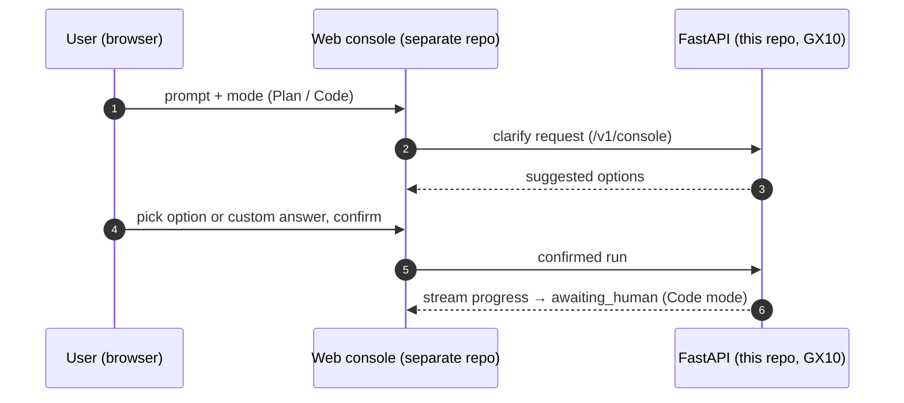

# Product vision: interactive sprint console

**Status: Target — not implemented.** This document describes where the product is headed, not what exists today. For current behavior see [agent-orchestration.md](../agent-orchestration.md).

## Current system (July 2026)

Sprint Crew v2 is a headless FastAPI + LangGraph backend on the GX10 (dual vLLM lanes: Coder :8001, Work :8002). Users call `POST /sprint/from-prompt` (ScrumMaster builds a backlog, then sequential per-ticket cycles) or `POST /sprint/from-ticket` (single cycle, no ScrumMaster). Runs end at `awaiting_human`; a human merges the PR manually per [ADR 0010](../adr/0010-manual-merge-gate.md). A backend console API MVP (`/v1/console/*`) now exists (see [roadmap](../roadmap.md) Phase 1.5), but there is still no browser UI.

## Target UX

A Cursor-like chat console in the browser, developed in a **separate repository** and hosted off the GX10 ([ADR 0011](../adr/0011-web-console-off-gx.md)). The console talks only to this repo's FastAPI API — never directly to the vLLM lanes.

The user picks one of two modes ([ADR 0012](../adr/0012-plan-code-modes-and-clarify.md)):

- **Plan** — analysis and backlog exploration only. Nothing is shipped; no branch, no PR.
- **Code** — the current ship-to-PR pipeline (implement → test → review → PR → `awaiting_human`).

Before any sprint run, the console runs a **clarify** step: the backend proposes suggested options (scope, target files, test expectations), the user can pick one or type a custom answer, and the run starts only after an **explicit confirmation**. No sprint executes on a raw prompt alone.

## What does not change

- The human merge gate stays: agents never auto-merge ([ADR 0010](../adr/0010-manual-merge-gate.md)).
- This repo remains the GX10 backend; the GPU serves inference, not web traffic.

See the [roadmap](../roadmap.md) for phasing and acceptance criteria.
